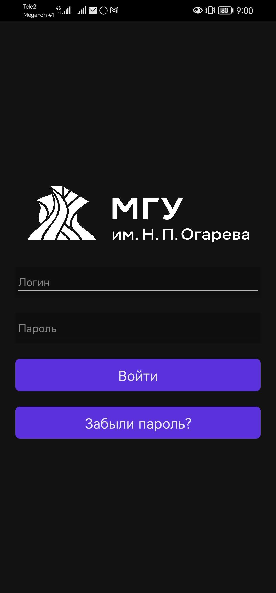
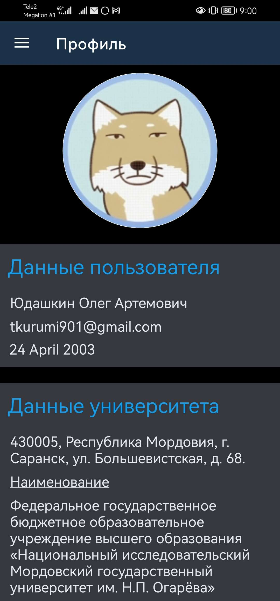
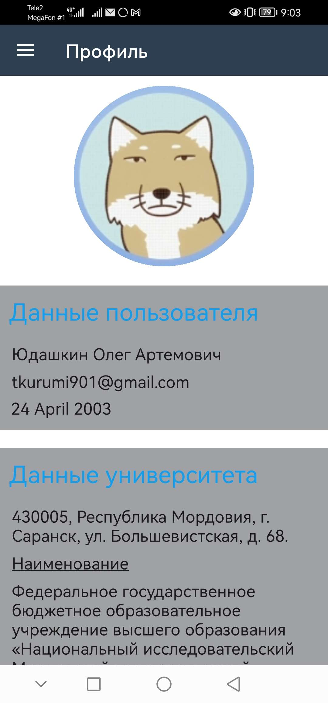
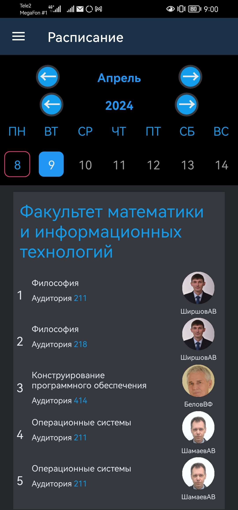
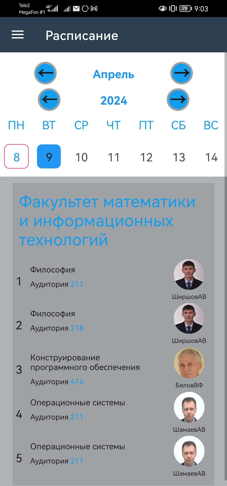
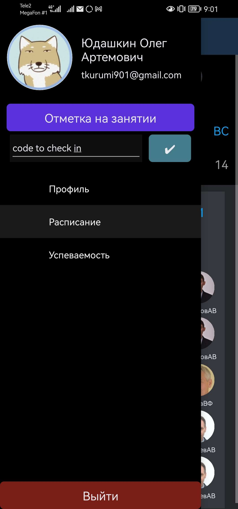
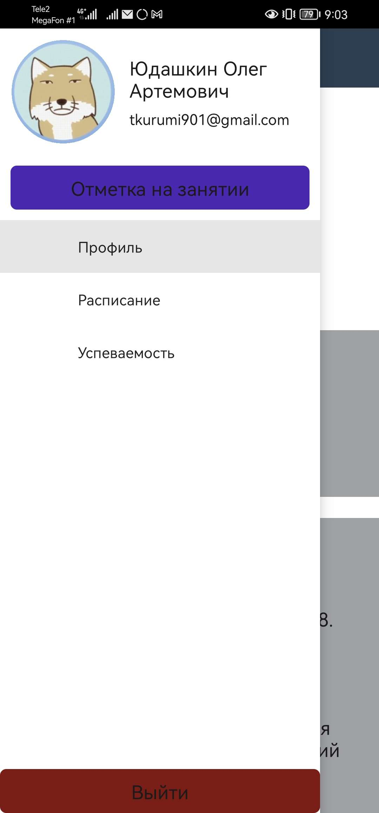

# MRSUMobile

MRSUMobile is a mobile application for MRSU university. It provides various features to enhance the student experience, including:

- Check-in functionality for classes
- Timetable display
- Disciplines page
- Other small features

The application supports both dark and light themes, allowing users to customize their visual experience.

## How it works

MRSUMobile relies on a public API provided by MRSU university. This API, located at [https://papi.mrsu.ru/](https://papi.mrsu.ru/), allows the application to retrieve and update data related to student information, class schedules, and more. The application communicates with the API using HTTP requests and processes the received data to provide the desired functionality.

## Architecture

MRSUMobile is built using the MVVM (Model-View-ViewModel) architectural pattern. This pattern separates the user interface (View) from the business logic (ViewModel) and the data (Model), promoting a clean and maintainable codebase.

## Security

To ensure the security of user data, MRSUMobile utilizes secure data preferences to store and manage authentication tokens. This allows for automatic login into user accounts whenever possible, providing a seamless user experience.

## Available Devices

MRSUMobile is available on the following platforms:

- Windows
- Android
- iOS

## Getting Started

To get started with MRSUMobile, follow these steps:

1. Clone the repository: `git clone 'https://github.com/tokKurumi/MRSUMobile.git'`
2. Open the project in your preferred development environment.
3. Build and run the application on your mobile device or emulator.

## Contributing

Contributions to MRSUMobile are welcome! If you would like to contribute, please follow these guidelines:

1. Fork the repository.
2. Create a new branch for your feature or bug fix.
3. Make your changes and commit them.
4. Push your changes to your forked repository.
5. Submit a pull request detailing your changes.

## License

MRSUMobile is licensed under the [MIT License](LICENSE). Feel free to use, modify, and distribute this project as per the terms of the license.

## Screenshots

Here are some screenshots of the MRSUMobile application:

*Login page*

*Profile page (dark)*

*Profile page (light)*

*Timetable page (dark)*

*Timetable page (light)*

*Flyout (dark)*

*Flyout (light)*